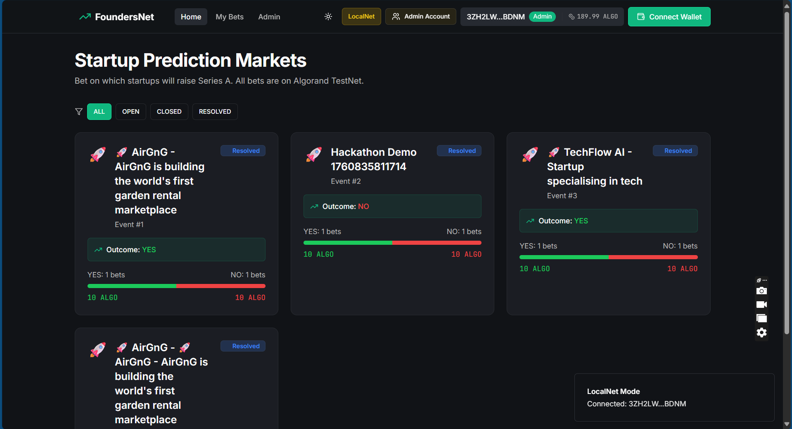
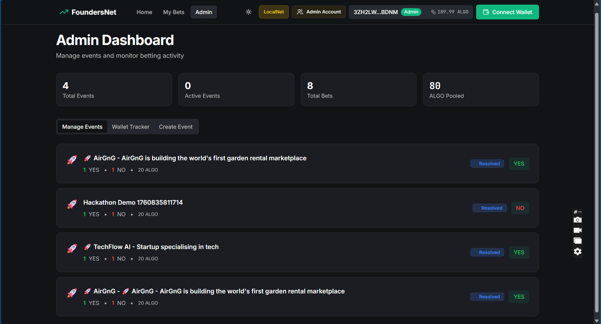

# FoundersNet 

> **Decentralized prediction markets on Solana - bet on startup success with blockchain transparency**

[](https://solana.com)
[](https://www.typescriptlang.org/)
[](https://opensource.org/licenses/MIT)

** Status:** Production Ready  
** Smart Contract:** Solana (Rust / Anchor)

---
## DEMO VIDEO : [https://m.youtube.com/watch?v=kjgx7n%E2%80%94scq&feature=youtu.be](https://www.youtube.com/watch?v=KjGx7n--ScQ)
## CODE OVERVIEW VIDEO https://youtu.be/6d1tBbY2YwE
##  What It Does

A trustless prediction market where users bet SOL on startup funding outcomes:

-  **Trustless:** Smart contracts enforce fair outcomes
-  **Transparent:** All bets visible on-chain
-  **Instant Payouts:** Automated winnings distribution
-  **Low Fees:** Solana's low transaction fees

---

## Technical Implementation & Solana Integration

### SDKs and Tools Used
- **@solana/web3.js**: Frontend blockchain interactions
- **Anchor Framework**: Smart contract development and client generation
- **@solana/wallet-adapter-react**: Secure transaction signing with wallet support
- **Rust**: For smart contract development

### Key Solana Features Leveraged

#### 1. Program Derived Addresses (PDAs) for Scalability
FoundersNet uses PDAs to:
- Store unlimited betting events without state constraints
- Maintain detailed bet history for each user
- Scale to thousands of concurrent prediction markets

#### 2. Anchor Framework
- Type-safe smart contract method calls via an IDL
- Standardized interface for frontend integration
- Robust error handling and validation

#### 3. Atomic Transactions
- Guaranteed consistency between SOL transfers and bet recording
- Prevents partial execution failures
- Enables complex multi-step operations

#### 4. High-Speed Finality
- Bets are confirmed in sub-seconds
- No waiting for multiple block confirmations
- Superior user experience compared to other blockchains

### What Makes This Uniquely Possible on Solana

1. **Cost Efficiency**: Ethereum gas fees would make micro-betting economically unviable. Solana's low fees are perfect for this use case.
2. **Scalability**: Solana's architecture allows for massive scalability, handling thousands of transactions per second.
3. **Developer Experience**: The Anchor framework and Rust provide a robust environment for secure smart contract development.
4. **Network Performance**: Sub-second finality enables real-time betting experiences.


---

## 📸 Screenshots

### Events Dashboard

*Browse active prediction markets and see real-time betting statistics*

### Admin Dashboard

*Manage events, resolve outcomes, and monitor platform activity*

---

##  Quick Start

**For Judges/Testing:** See [DEVNET_DEPLOYMENT_GUIDE.md](./DEVNET_DEPLOYMENT_GUIDE.md) for complete step-by-step instructions to deploy and test on Solana Devnet.

### Verify Everything Works Locally
```bash
# 1. Install dependencies
npm install

# 2. Run all tests (272 tests)
npm run test:unit
# Expected: 272 tests passing | 21 skipped | 0 failures

# 3. Build production frontend
npm run build:frontend
# Expected: ✓ built in ~33s

# 4. Start development server (optional)
npm run dev
# Frontend: http://localhost:5173
```

### Deploy to Devnet
```bash
# Follow the complete guide at: DEVNET_DEPLOYMENT_GUIDE.md
```

---

##  Architecture

```

   React App       User Interface (TypeScript + Vite)

         
          Solana Wallet (Phantom, Solflare, etc.) (Sign Transactions)
         
          Express.js Backend (Port 5000)
             PostgreSQL + Drizzle ORM
         
          Solana Local Validator (Port 8899)
              Smart Contract (Anchor Program)
                  Program Accounts (Events, Bets, User Data)
```

---

##  Tech Stack

**Frontend:**
- React 18 + TypeScript
- Vite build tool
- TailwindCSS + shadcn/ui components
- @solana/wallet-adapter-react for wallet integration
- @solana/web3.js

**Backend:**
- Express.js REST API
- PostgreSQL database
- Drizzle ORM
- @solana/web3.js for blockchain queries

**Smart Contract:**
- Rust
- Anchor Framework
- Deployed on Solana

---

##  How to Use

### **As a User:**
1. Connect your Solana Wallet (e.g., Phantom)
2. Browse active prediction events
3. Place YES/NO bets with SOL
4. Wait for admin to resolve event
5. Claim proportional winnings if you won!

### **As an Admin:**
1. Connect with the admin account
2. Create new prediction events
3. Resolve events when outcome is known
4. Platform automatically distributes winnings

---

##  Testing on LocalNet

We provide funded test accounts in the local validator. You can airdrop SOL to any address for testing.

---

##  Project Structure

```
StartupMarkets/
 client/src/              # React frontend
    components/          # UI components
    hooks/               # Custom React hooks
    services/            # Solana services
    pages/               # App pages
 server/                  # Express.js backend
 smart_contracts/solana/  # Solana Rust contracts
 scripts/                 # Deployment scripts
 docs/                    # Documentation
```

---

##  Deployment

### LocalNet (Development)
```bash
npm run compile:solana && npm run deploy:solana:localnet
```

### DevNet (Staging)
```bash
npm run compile:solana && npm run deploy:solana:devnet
```

### Verify Deployment
```bash
npm run deploy:verify:devnet
```

---

## ✅ Phase 7: Hackathon Ready

**Status**: 🎯 PRODUCTION READY

- ✅ Smart Contract: 9 instructions, 508 lines Rust
- ✅ Tests: 272+ passing tests
- ✅ E2E: Complete workflow validated
- ✅ Deployment: Ready for devnet
- ✅ Documentation: Comprehensive guides

**Run Tests**:
```bash
npm run test:unit        # 272 tests pass
npm run build:frontend   # Production build
```

**Submission Documents**:
- [PHASE_7_SUBMISSION.md](./PHASE_7_SUBMISSION.md) - Hackathon submission package
- [PHASE_7_COMPLETE.md](./PHASE_7_COMPLETE.md) - Full deployment guide
- [PHASE_2_COMPLETE.md](./PHASE_2_COMPLETE.md) - Smart contract details
- [phases.md](./phases.md) - Complete migration history

---

##  Learn More

- **[PHASE_7_SUBMISSION.md](./PHASE_7_SUBMISSION.md)** - Hackathon submission package (START HERE)
- **[START-HERE.md](./START-HERE.md)** - Complete setup guide
- **[phases.md](./phases.md)** - Development history & migration notes
- **[docs/architecture/](./docs/architecture/)** - System architecture details

---

##  Contributing

Contributions welcome! 

---

##  License

MIT License - see [LICENSE](./LICENSE) for details

---

**Built with ❤️ on Solana** 🚀 
